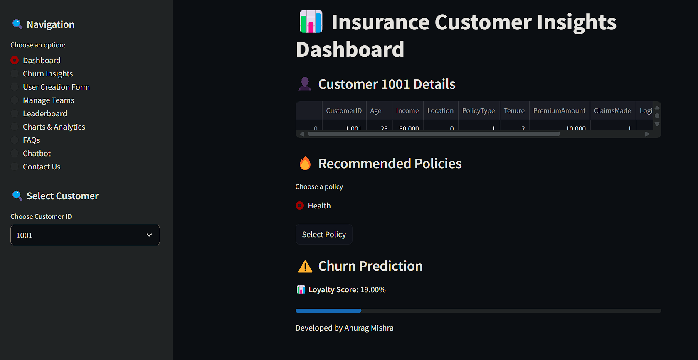

# SBI Life Insurance - Customer Insights Dashboard with AI Chatbot

Welcome to the **SBI Life Insurance Customer Insights Dashboard**! This platform is designed to provide deep insights into customer behavior, predict churn, recommend personalized insurance policies, and offer an AI-powered chatbot for seamless customer support. Built with cutting-edge technology, this system helps insurance agents and administrators make data-driven decisions while enhancing customer experience.

---

## 🚀 **Key Features**

### 📊 **Insurance Customer Insights Dashboard**
- **Customer Details**: View detailed information about each customer, including their loyalty score, churn probability, and policy recommendations.
- **Churn Prediction**: Identify customers at high risk of churn and take proactive measures to retain them.
- **Loyalty Score**: Measure customer loyalty with a dynamic score that updates based on their interactions and behavior.
- **Policy Recommendations**: Suggest tailored insurance policies based on customer profiles and preferences.

### 🤖 **AI Chatbot**
- **Custom Data Training**: Easily train the chatbot using a `data.txt` file containing FAQs, policy details, and other relevant information.
- **Policy Suggestions**: The chatbot can recommend the best insurance policies based on customer needs and preferences.
- **24/7 Support**: Provide instant assistance to customers with an AI-powered chatbot that can handle queries, policy updates, and more.

### 📝 **User Creation & Management**
- **User Creation Form**: Add new customers or agents with a simple form.
- **Manage Teams**: View and manage registered users, their roles, and statuses.
- **Leaderboard**: Track top-performing users based on their scores and achievements.

### 📉 **Charts & Analytics**
- **Customer Churn Rate**: Visualize churn rates over time.
- **User Role Distribution**: Analyze the distribution of users by role (e.g., customer, agent).
- **User Score Distribution**: View the distribution of loyalty scores across users.
- **Top Users by Score**: Identify top-performing users with the highest loyalty scores.

### ❓ **FAQs**
- **Dynamic FAQs**: Answer common customer questions with a comprehensive FAQ section.
- **Customizable**: Easily update FAQs to reflect the latest policies and customer concerns.

### 📥 **Data Export**
- **Download User Data**: Export user data in CSV format, including fields like `CustomerID`, `Age`, `Income`, `Location`, `PolicyType`, `Tenure`, `PremiumAmount`, `ClaimsMade`, `LoginFrequency`, `SupportCalls`, and `Churn`.
- **Download Policy Data**: Export policy details for further analysis.

---


## 🛠️ **Installation**

### Prerequisites
- Node.js (v16 or higher)
- A modern web browser (Chrome, Firefox, Edge, etc.)

---

### Step 1: Clone the Repository
Clone the repository to your local machine using the following command:

```bash
git clone https://github.com/your-repo/sbi-life-insurance-website.git
cd sbi-life-insurance-website
```

---

### Step 2: Install Dependencies
Install the required dependencies using npm:

```bash
npm install
```

---

### Step 3: Set Up the CSV File
1. Create a CSV file named `insurance_data_example.csv` in the root directory.
2. Add the following sample data to the CSV file:

   ```
   Name,Age,Gender,Health Conditions,Occupation,Income Level,Family Dependents,Lifestyle Choices,Policy History,Coins
   rahul,28,Male,None,Software Engineer,High,2,"Gym, Non-Smoker",No Claims,1000
   Priya Patel,35,Female,Diabetes,Doctor,High,4,"Yoga, Non-Smoker",One Claim,1000
   ```

3. Ensure the CSV file path in the `fetchCSVAndUpdateCoins` function matches the file location:

   ```javascript
   const response = await fetch('insurance_data_example.csv');
   ```

---

### Step 4: Run the Application
Start the development server:

```bash
npm start
```

The website should now be running on `http://localhost:3000`.

---


## 📂 **File Structure**

```
sbi-life-insurance-website/
├── index.html
├── styles.css
├── main.js
├── insurance_data_example.csv
├── assets/
│   ├── img/
│   ├── video/
│   ├── css/
│   └── js/
├── README.md
└── package.json
```

---

## 🛡️ **Dependencies**
The project uses the following libraries:
- [Swiper](https://swiperjs.com/): For the popular plans swiper.
- [MixItUp](https://www.kunkalabs.com/mixitup/): For filtering featured insurance plans.
- [ScrollReveal](https://scrollrevealjs.org/): For scroll animations.

---

## 🎯 **Usage**

### Dashboard
- Navigate to the **Dashboard** to view customer insights, churn predictions, and policy recommendations.
- Use filters to analyze specific customer segments.

### AI Chatbot
- Interact with the chatbot to get instant answers to customer queries.
- Train the chatbot with new data by updating `data.txt`.

### User Management
- Add new users via the **User Creation Form**.
- Manage existing users and their roles in the **Manage Teams** section.

### Analytics
- Explore **Charts & Analytics** to gain insights into customer behavior and performance metrics.

### FAQs
- Update the **FAQs** section to address common customer concerns.

---

## 📂 **Data Management**

### User Data
User data is stored in a CSV format with the following fields:
- `id`
- `name`
- `email`
- `role`
- `status`
- `Badge`

Example:
```
id,name,email,role,status,Badge
1,ANURAG MISHRA,,Customer,Rejected,🏆 Elite
2,ANURAG MISHRA,anmi21aiml@cmrit.ac.in,Customer,Pending,🟢 Beginner
```

### Policy Data
Policy data is stored in a CSV format with the following fields:
- `CustomerID`
- `Age`
- `Income`
- `Location`
- `PolicyType`
- `Tenure`
- `PremiumAmount`
- `ClaimsMade`
- `LoginFrequency`
- `SupportCalls`
- `Churn`

Example:
```
CustomerID,Age,Income,Location,PolicyType,Tenure,PremiumAmount,ClaimsMade,LoginFrequency,SupportCalls,Churn
1001,25,50000,0,1,2,10000,1,30,2,0
```

---

## 🛡️ **Policy Recommendations**

The system recommends insurance policies based on customer profiles. Here are some examples:

### 1. **Protection Plans**
- **SBI Life – eShield Next (id: sbipp1)**: A term plan offering multiple coverage options.
- **SBI Life – Saral Jeevan Bima (id: sbipp2)**: A straightforward term insurance plan.
- **SBI Life – Sampoorna Cancer Suraksha (id: sbipp3)**: A specialized plan for cancer coverage.

### 2. **Savings Plans**
- **SBI Life – Smart Swadhan Plus (id: sbisp1)**: A term assurance plan with a return of premiums.
- **SBI Life – Shubh Nivesh (id: sbisp2)**: An endowment plan offering regular income.

### 3. **ULIPs**
- **SBI Life – Smart Wealth Assure (id: sbiu1)**: A single premium ULIP with market-linked returns.
- **SBI Life – Smart Elite (id: sbiu2)**: A limited premium payment ULIP for high net-worth individuals.

### 4. **Retirement Plans**
- **SBI Life – Retire Smart (id: sbirp1)**: A ULIP offering assured additions for retirement.
- **SBI Life – Saral Pension (id: sbirp2)**: A traditional pension plan providing regular income.

### 5. **Child Plans**
- **SBI Life – Smart Champ Insurance (id: sbicp1)**: A plan to support your child's education.

### 6. **Money Back Plans**
- **SBI Life – Smart Money Back Gold (id: sbimbp1)**: A money-back plan with regular payouts.

### 7. **Whole Life Plans**
- **SBI Life – Shubh Nivesh (Whole Life Option) (id: sbiwlp1)**: An endowment plan with whole life coverage.

---

## 📜 **FAQs**

### Q1: How is churn probability calculated?
A: Churn probability is predicted using a trained machine learning model based on customer behavior and historical data.

### Q2: Can I update policy recommendations?
A: Yes, policy recommendations are dynamically updated based on customer interactions and preferences.

### Q3: How do I train the AI chatbot?
A: Simply update the `data.txt` file with your custom data and run the training script.

### Q4: How do I update the coin data?
A: Update the insurance_data_example.csv file with the latest user data. The coin count will automatically refresh.

### Q5: How do I add new videos to the slider?
A: Add new video files to the assets/video/ folder and update the slides array in the main.js file.

### Q6: How do I customize the scroll animations?
A: Modify the ScrollReveal configuration in the main.js file.

---

Thank you for using the **SBI Life Insurance Customer Insights Dashboard**! We hope this tool helps you deliver exceptional service to your customers. 🚀