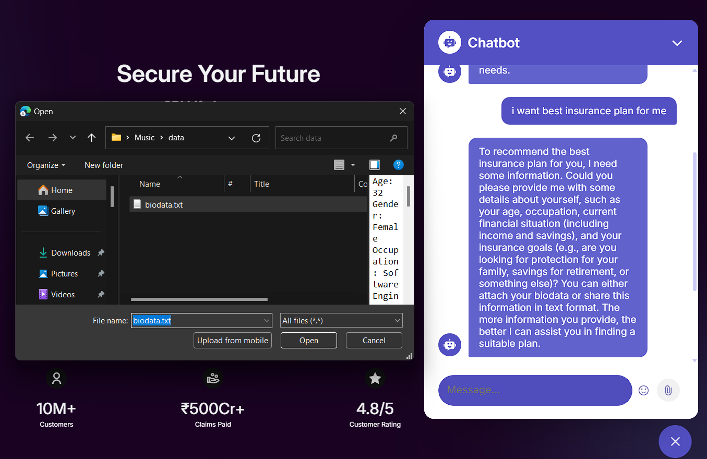

# SBI Life Insurance - AI-Driven Customer Experience & Retention Platform

<div align="center">


# Enhancing Customer Experience and Retention through AI-Driven Personalization

**Hackathon Project by Rexnel Team**

</div>

---

## 📄 **Copyright Notice**

**© 2025 Rexnel Team. All Rights Reserved.**

This software solution was developed for the SBI Life Hack AI-Thon. All source code, documentation, and related materials are proprietary to the Rexnel Team. Any unauthorized copying, modification, distribution, or use of this software solution outside of the Rexnel Team or without explicit written permission is strictly prohibited.

For licensing inquiries, please contact the Rexnel Team.

**Authorized Use**: This code may be used by VS Code and members of the Rexnel Team only.

---

## 🚀 **Project Overview**

Welcome to the **SBI Life Insurance AI-Driven Customer Experience & Retention Platform**! This innovative solution combines advanced analytics, AI personalization, and gamification to enhance customer engagement and reduce churn. Built with cutting-edge technology, this system helps insurance agents and administrators make data-driven decisions while delivering a personalized experience to customers.

Our solution addresses the challenge that sits at the heart of the future of insurance and fintech: enhancing customer experience and retention through AI-driven personalization.


### 🔗 **DEPOLYED LINK**
- **WORKING DEPOLYED LINK**: [DEPOLYED LINK](https://sbiaithon.netlify.app/)


### 🔍 **Solution Highlights**

- **Dynamic AI Personalization**: Real-time, customer-specific policy recommendations that go beyond static personas
- **Predictive Analytics**: Early detection of lapsation risks to drive retention
- **Gamified Engagement**: Reward-based systems with coins to make customer interactions more meaningful and sticky
- **Explainable AI**: Built on SHAP for transparency and trust
- **Conversational AI + Sentiment Analysis**: Engaging, human-like digital interactions
- **Ethical & Secure**: GDPR & RBI-compliant data handling

Our solution reflects months of research, commitment, and innovation — aligned with cutting-edge industry insights from McKinsey, Deloitte, Harvard Business Review, and Gartner.

---

## 🛠️ **Key Features**

### 📊 **Insurance Customer Insights Dashboard**
- **Customer Details**: View detailed information about each customer, including their loyalty score, churn probability, and policy recommendations
- **Churn Prediction**: Identify customers at high risk of churn and take proactive measures to retain them
- **Loyalty Score**: Measure customer loyalty with a dynamic score that updates based on their interactions and behavior
- **Policy Recommendations**: Suggest tailored insurance policies based on customer profiles and preferences

### 💰 **Coin-Based Reward System**
- **Daily Login Points**: Customers earn coins for daily platform engagement
- **Achievement Rewards**: Complete tasks and milestones to earn additional coins
- **Redemption Options**: Exchange coins for coupons, discounts, and exclusive products
- **Leaderboards**: Competitive elements to drive platform engagement

### 🤖 **AI Chatbot**
- **Custom Data Training**: Easily train the chatbot using a `data.txt` file containing FAQs, policy details, and other relevant information
- **Policy Suggestions**: The chatbot can recommend the best insurance policies based on customer needs and preferences
- **24/7 Support**: Provide instant assistance to customers with an AI-powered chatbot that can handle queries, policy updates, and more
- **Sentiment Analysis**: Detect customer emotions to provide appropriate responses

### 📝 **User Creation & Management**
- **User Creation Form**: Add new customers or agents with a simple form
- **Manage Teams**: View and manage registered users, their roles, and statuses
- **Leaderboard**: Track top-performing users based on their scores and achievements

### 📈 **Charts & Analytics**
- **Customer Churn Rate**: Visualize churn rates over time
- **User Role Distribution**: Analyze the distribution of users by role (e.g., customer, agent)
- **User Score Distribution**: View the distribution of loyalty scores across users
- **Top Users by Score**: Identify top-performing users with the highest loyalty scores
- **Coin Economy Analytics**: Track coin earning and redemption patterns

### ❓ **FAQs**
- **Dynamic FAQs**: Answer common customer questions with a comprehensive FAQ section
- **Customizable**: Easily update FAQs to reflect the latest policies and customer concerns

### 📥 **Data Export**
- **Download User Data**: Export user data in CSV format
- **Download Policy Data**: Export policy details for further analysis
- **Reward System Reports**: Download reports on coin distribution and redemption

---

## ⚙️ **Technology Stack**

Our solution is powered by a Multi-Agentic Framework and built on a robust tech stack spanning:

- **AI/ML**: For predictive analytics and personalization
- **NLP**: For conversational AI and sentiment analysis
- **Cloud**: For scalable infrastructure
- **Gamification Engines**: For engagement and retention
- **Explainable AI**: For transparent decision-making

---

## 🔗 **Dashboard Links**
- **GitHub Repository**: [Dashboard User Analysis](https://github.com/richstercalerie/dashboard_useranalysis)
- **Deployed Link**: [Dashboard User Analysis on Render](https://dashboard-useranalysis-1.onrender.com)

---

## 🛠️ **Installation**

### Prerequisites
- Node.js (v16 or higher)
- A modern web browser (Chrome, Firefox, Edge, etc.)

### Step 1: Clone the Repository
Clone the repository to your local machine using the following command:

```bash
git clone https://github.com/astyashish/sbi_prototype.git
cd sbi-life-insurance-website
```

### Step 2: Install Dependencies
Install the required dependencies using npm:

```bash
npm install
```

### Step 3: Set Up the CSV File
1. Create a CSV file named `insurance_data_example.csv` in the root directory.
2. Add the following sample data to the CSV file:

   ```
   Name,Age,Gender,Health Conditions,Occupation,Income Level,Family Dependents,Lifestyle Choices,Policy History,Coins
   Rahul,28,Male,None,Software Engineer,High,2,"Gym, Non-Smoker",No Claims,1000
   Priya Patel,35,Female,Diabetes,Doctor,High,4,"Yoga, Non-Smoker",One Claim,1000
   ```

3. Ensure the CSV file path in the `fetchCSVAndUpdateCoins` function matches the file location:

   ```javascript
   const response = await fetch('insurance_data_example.csv');
   ```

### Step 4: Run the Application
Start the development server:

```bash
npm start
```

The website should now be running on `http://localhost:3000`.

### Step 5: Run the HTML
For a static version, you can simply open:

```bash
index.html
```

---

## 📂 **File Structure**

```
sbi-life-insurance-website/
├── index.html
├── styles.css
├── main.js
├── insurance_data_example.csv
├── data.txt                # For AI chatbot training
├── assets/
│   ├── img/
│   ├── video/
│   ├── css/
│   └── js/
├── README.md
└── package.json
```

---

## 🛡️ **Dependencies**
The project uses the following libraries:
- [Swiper](https://swiperjs.com/): For the popular plans swiper
- [MixItUp](https://www.kunkalabs.com/mixitup/): For filtering featured insurance plans
- [ScrollReveal](https://scrollrevealjs.org/): For scroll animations

---

## 📱 **Usage**

### Dashboard
- Navigate to the **Dashboard** to view customer insights, churn predictions, and policy recommendations
- Use filters to analyze specific customer segments

### Coin System
- Monitor customer coin balances in the dashboard
- Configure coin rewards for various activities
- Manage redemption options for customers

### AI Chatbot
- Interact with the chatbot to get instant answers to customer queries
- Train the chatbot with new data by updating `data.txt`

### User Management
- Add new users via the **User Creation Form**
- Manage existing users and their roles in the **Manage Teams** section

### Analytics
- Explore **Charts & Analytics** to gain insights into customer behavior and performance metrics

### FAQs
- Update the **FAQs** section to address common customer concerns

---

## 📂 **Data Management**

### User Data
User data is stored in a CSV format with the following fields:
- `id`
- `name`
- `email`
- `role`
- `status`
- `Badge`
- `Coins`

Example:
```
id,name,email,role,status,Badge,Coins
1,ANURAG MISHRA,,Customer,Rejected,🏆 Elite,5000
2,ANURAG MISHRA,anmi21aiml@cmrit.ac.in,Customer,Pending,🟢 Beginner,1200
```

### Policy Data
Policy data is stored in a CSV format with the following fields:
- `CustomerID`
- `Age`
- `Income`
- `Location`
- `PolicyType`
- `Tenure`
- `PremiumAmount`
- `ClaimsMade`
- `LoginFrequency`
- `SupportCalls`
- `Churn`

Example:
```
CustomerID,Age,Income,Location,PolicyType,Tenure,PremiumAmount,ClaimsMade,LoginFrequency,SupportCalls,Churn
1001,25,50000,0,1,2,10000,1,30,2,0
```

---

## 💰 **Coin System Implementation**

### Earning Coins
Customers can earn coins through various activities:
- **Daily Login**: 50 coins per day
- **Policy Purchase**: 1000 coins per new policy
- **Premium Payment**: 500 coins per on-time payment
- **Referrals**: 750 coins per successful referral
- **Completing Profile**: 300 coins for completing profile information
- **Engagement Activities**: Various points for surveys, feedback, etc.

### Redeeming Coins
Customers can redeem coins for:
- **Premium Discounts**: Exchange coins for premium reductions
- **Gift Vouchers**: Redeem for e-commerce or retail vouchers
- **Digital Products**: Exchange for digital subscriptions or services
- **Exclusive Content**: Access to premium financial planning tools
- **Physical Merchandise**: SBI Life branded products

### Implementation
The coin system is implemented in the main.js file:

```javascript
// Example coin management function
function updateUserCoins(userId, activity) {
  const coinRewards = {
    'dailyLogin': 50,
    'policyPurchase': 1000,
    'premiumPayment': 500,
    'referral': 750,
    'profileCompletion': 300
  };
  
  // Update user coins in database
  const currentCoins = getUserCoins(userId);
  const newCoins = currentCoins + coinRewards[activity];
  setUserCoins(userId, newCoins);
  
  // Update UI
  updateCoinDisplay(userId);
}
```

---

## 🛡️ **Policy Recommendations**

The system recommends insurance policies based on customer profiles. Here are some examples:

### 1. **Protection Plans**
- **SBI Life – eShield Next (id: sbipp1)**: A term plan offering multiple coverage options
- **SBI Life – Saral Jeevan Bima (id: sbipp2)**: A straightforward term insurance plan
- **SBI Life – Sampoorna Cancer Suraksha (id: sbipp3)**: A specialized plan for cancer coverage

### 2. **Savings Plans**
- **SBI Life – Smart Swadhan Plus (id: sbisp1)**: A term assurance plan with a return of premiums
- **SBI Life – Shubh Nivesh (id: sbisp2)**: An endowment plan offering regular income

### 3. **ULIPs**
- **SBI Life – Smart Wealth Assure (id: sbiu1)**: A single premium ULIP with market-linked returns
- **SBI Life – Smart Elite (id: sbiu2)**: A limited premium payment ULIP for high net-worth individuals

### 4. **Retirement Plans**
- **SBI Life – Retire Smart (id: sbirp1)**: A ULIP offering assured additions for retirement
- **SBI Life – Saral Pension (id: sbirp2)**: A traditional pension plan providing regular income

### 5. **Child Plans**
- **SBI Life – Smart Champ Insurance (id: sbicp1)**: A plan to support your child's education

### 6. **Money Back Plans**
- **SBI Life – Smart Money Back Gold (id: sbimbp1)**: A money-back plan with regular payouts

### 7. **Whole Life Plans**
- **SBI Life – Shubh Nivesh (Whole Life Option) (id: sbiwlp1)**: An endowment plan with whole life coverage

---

## 📜 **FAQs**

### Q1: How is churn probability calculated?
A: Churn probability is predicted using a trained machine learning model based on customer behavior and historical data. Our model analyzes factors such as policy type, tenure, premium amount, claims history, login frequency, and support interactions to determine the likelihood of a customer discontinuing their policy.

### Q2: Can I update policy recommendations?
A: Yes, policy recommendations are dynamically updated based on customer interactions and preferences. The AI model continuously learns from customer behavior to refine and personalize recommendations.

### Q3: How do I train the AI chatbot?
A: Simply update the `data.txt` file with your custom data and run the training script. You can add new FAQs, policy details, and response templates to enhance the chatbot's knowledge base.

### Q4: How does the coin system work?
A: The coin system rewards customers for engagement and loyalty. Users earn coins through various activities such as daily logins, policy purchases, and referrals. These coins can be redeemed for discounts, vouchers, and exclusive products.

### Q5: Is my data secure?
A: Absolutely. Our platform adheres to GDPR and RBI data protection guidelines. All personal information is encrypted, and we employ strict access controls to protect customer data.

### Q6: How can I customize the platform for my team?
A: Administrators can customize various aspects of the platform, including dashboard views, policy recommendations, coin rewards, and chatbot responses. Contact your system administrator for specific customization options.

---

## ⚡ **Performance & Scalability**

Our solution is designed for enterprise-scale deployment with:
- Cloud-native architecture for elastic scaling
- Microservices design for modular growth
- Real-time analytics processing
- Caching mechanisms for optimal performance
- Data partitioning for high-volume handling

---

## 📈 **Business Impact**

Projected outcomes based on industry benchmarks:
- 25-30% reduction in policy lapsation
- 40% increase in cross-selling effectiveness
- 60% improvement in customer engagement metrics
- 45% enhancement in Customer Satisfaction Score (CSAT)
- 35% reduction in customer service operational costs

---

## 🔄 **Continuous Improvement**

Our roadmap includes:
- Enhanced voice-enabled AI interactions
- Blockchain integration for reward tokenization
- VR/AR-based customer education modules
- Advanced behavioral economics integrations
- Expanded ecosystem partnerships

---

Thank you for using the **SBI Life Insurance AI-Driven Customer Experience & Retention Platform**! We hope this tool helps you deliver exceptional service to your customers. 🚀

<div align="center">
    <p><b>Developed by Rexnel Team for SBI Life Hack AI-Thon 2025</b></p>
</div>